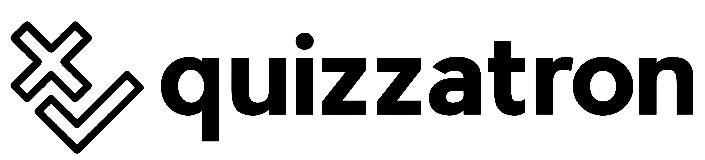
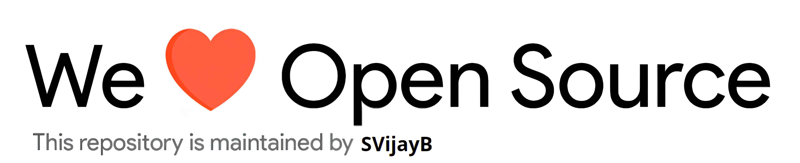

# Quizzatron

    
     We one-up QuizUp!

---

    

## Table of Contents

-   [Motivation](#Motivation)
-   [Installation](#Installation)
-   [Usage](#Usage)
    -   [Project Demo](#Demo)
-   [Contributing](#Contributing)
-   [License](#License)

## Motivation

<!--- Insert product screenshot below --->

We’re building an AI-powered quizzing system that can generate questions on any topic - SATs, movies, national flags, or whatever you choose! The application supports custom inputs like PDFs or images and can also generate quizzes autonomously using DeepSeek. It provides an engaging learning experience with minimal human input.

To maximize accessibility, our model integrates with APIs, allowing it to function as a Discord bot, a web interface, or a CLI tool. But we didn’t stop there, we wanted to make quizzing fun. Inspired by **QuizUp**, we focused on gamification, incorporating features that users love based on insights from [community discussions](https://www.reddit.com/r/QuizUp/comments/1ahl958/what_the_hell_happened_to_quizup/).

We also used some standard open source trivia data, such as the [OpenTriviaQA](https://github.com/uberspot/OpenTriviaQA) and the [opentdb API](https://opentdb.com/).

## Installation

<!--- Provide instructions on installing the application --->

For the latest stable version, head to [Releases](https://github.com/SVijayB/Quizzatron/releases).

Download and extract the source code.

As an alternative, you could also clone the repository using,

<pre>
git clone https://github.com/SVijayB/Quizzatron
</pre>

Once you have the source code, create a virtual environment using the following command,
`python3 -m venv venv`

Enter the virtual environment and install dependancies using `pip install -r requirements.txt`.

## Usage

<!--- Provide instructions on how to use the application after installing it --->

To launch the file, use the following command, `python3 app.py`.

<!--- You can also add in screenshots, app demo (Gif format) or even provide link to other resources --->

### Project demo

You can also find the demo video [here](https://www.youtube.com/watch?v=dQw4w9WgXcQ).

## Contributing

To contribute to Quizzatron, fork the repository, create a new branch and send us a pull request. Make sure you read [CONTRIBUTING.md](https://github.com/SVijayB/Quizzatron/blob/master/.github/CONTRIBUTING.md) before sending us Pull requests.

Thanks for contributing to Open-source! ❤️

## License

Quizzatron is under The MIT License. Read the [LICENSE](https://github.com/SVijayB/Quizzatron/blob/master/LICENSE) file for more information.

---

