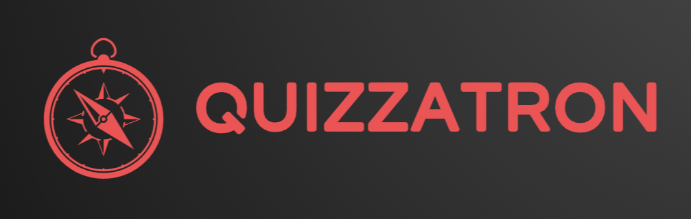
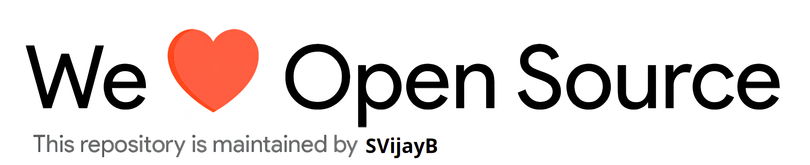

# Quizzatron

    
     AI Generated quizzes for the W! 

---

<!-- 

    

 -->

## Table of Contents

-   [Motivation](#Motivation)
-   [Installation](#Installation)
-   [Usage](#Usage)
    -   [Project Demo](#Demo)
-   [Contributing](#Contributing)
-   [License](#License)

## Motivation

<!--- Insert product screenshot below --->

Implementing AI/ML into a quizzing application. Model scrapes the internet for _any_ topic and then quizzes you on it. You can ask it for jee mock exams, MCU quizzes or even get quizzed on your favorite anime!

Questions are generated by the AI, hints are also provided if required, all of this entirely by the model with minimal to no human interaction.

Think of it as asking your friend to quiz you about any imaginable topic!

The model will also be implemented to interact with API, this allows us to have multiple different interfaces for the application. It can be integrated into a Discord bot, a GUI application, a website or an android app, whichever works best!

## Installation

<!--- Provide instructions on installing the application --->

For the latest stable version, head to [Releases](https://github.com/SVijayB/Quizzatron/releases). \
Download and extract the source code.

As an alternative, you could also clone the repository using,

<pre>
git clone https://github.com/SVijayB/Quizzatron
</pre>

Once you have the source code, create a virtual environment using the following command,
`python3 -m venv venv`

Enter the virtual environment and install dependancies using `pip install -r requirements.txt`.

## Usage

<!--- Provide instructions on how to use the application after installing it --->

To launch the file, use the following command, `python3 app.py`.

<!--- You can also add in screenshots, app demo (Gif format) or even provide link to other resources --->

## Contributing

To contribute to Repo-Template, fork the repository, create a new branch and send us a pull request. Make sure you read [CONTRIBUTING.md](https://github.com/SVijayB/Quizzatron/blob/master/.github/CONTRIBUTING.md) before sending us Pull requests.

Thanks for contributing to Open-source! ❤️

## License

Repo-Template is under The MIT License. Read the [LICENSE](https://github.com/SVijayB/Quizzatron/blob/master/LICENSE) file for more information.

---

