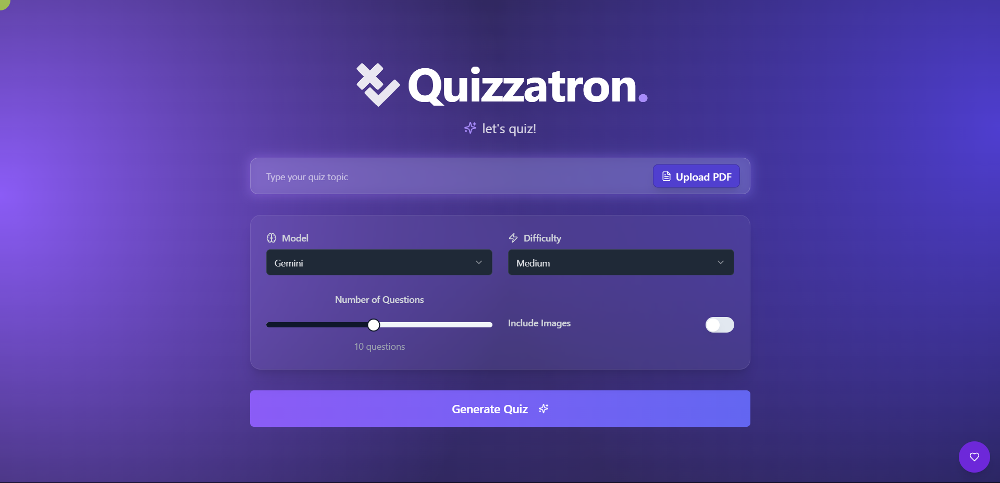
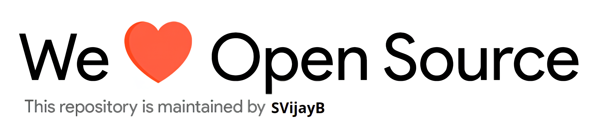

# Quizzatron

<p align="center">
    
    <br>We one-up QuizUp!

---

<p align="center">
    <a href="https://github.com/SVijayB/Quizzatron/pulls">
        
    </a>
<a href="https://github.com/SVijayB/Quizzatron/issues">
    
    </a>
<a href="https://github.com/SVijayB/Quizzatron/graphs/contributors">
    
    </a>
<a href="https://github.com/SVijayB/Quizzatron/blob/master/LICENSE">
    
    </a>
<a href="https://github.com/SVijayB/Quizzatron">
    
    </a>
<a href="https://github.com/SVijayB/Quizzatron/blob/master/.github/CODE_OF_CONDUCT.md">
    
    </a>
<a href="https://github.com/SVijayB/Quizzatron/blob/master/.github/CONTRIBUTING.md">
    
    </a>
    <br>
<a href="https://codecov.io/gh/SVijayB/Quizzatron" > 
     
    </a>
<a href="https://github.com/SVijayB/Quizzatron/actions">
    
    </a>
</p>

## Table of Contents

-   [Motivation](#motivation)
-   [Architecture](#architecture)
-   [Quick start](#quick-start)
-   [Environment variables](#environment-variables)
-   [Running it](#running-it)
-   [Testing and linting](#testing-and-linting)
-   [Project structure](#project-structure)
-   [Contributing](#contributing)
-   [License](#license)

## Motivation

<!--- Insert product screenshot below --->



Quizzatron generates a quiz on any topic you like — SATs, movies, national flags,
whatever — and lets you play it solo or against friends in real time. Give it a
topic, upload a PDF, or pick a category from a pre-written question bank.

Inspired by **QuizUp**, with a focus on gamification based on what people
actually missed about it ([community discussion](https://www.reddit.com/r/QuizUp/comments/1ahl958/what_the_hell_happened_to_quizup/)).
Pre-written questions come from [OpenTriviaQA](https://github.com/uberspot/OpenTriviaQA)
and the [opentdb API](https://opentdb.com/).

## Architecture

| Layer | Stack |
|---|---|
| Frontend | Vite · React 18 · TypeScript · Tailwind · Radix · framer-motion |
| API | Flask · Flask-SocketIO (threading mode) |
| Question generation | [pydantic-ai](https://pydantic.dev/docs/ai/) with schema-validated structured output |
| Providers | Google Gemini, Mistral, OpenAI, DeepSeek — or any model behind a [LiteLLM](https://docs.litellm.ai/) proxy |
| Question banks | OpenTDB (HTTP) and MongoDB (optional) |
| Images | Wikimedia — freely licensed, linked rather than re-hosted |

A few decisions worth knowing about:

-   **Question shape is uniform across every source.** Options are plain text
    with no `"A) "` prefixes, and the answer is an integer `correct_index`.
-   **Multiplayer is server-authoritative.** The server owns the countdown,
    grades every answer, and advances rounds on its own. The browser's timer is
    display-only. Dropped players and a departing host can't stall a game.
-   **The `litellm` SDK is deliberately not a dependency** — it pins `openai<3`
    while `pydantic-ai-slim[openai]` needs `openai>=3`. LiteLLM is supported as a
    *proxy* instead, which needs no app dependency. See `migration_plan.md`.
-   **It runs with no credentials at all.** With no API key, a built-in offline
    model serves placeholder quizzes so the UI and the test suite work. That's
    also why CI needs no secrets.
-   Lobbies are in-process, so the API is single-process by design.

## Quick start

Requires **Python 3.11+** and **Node 20+**.

```bash
git clone https://github.com/SVijayB/Quizzatron.git
cd Quizzatron
```

Backend — with [uv](https://docs.astral.sh/uv/) (recommended):

```bash
uv venv && source .venv/bin/activate    # Windows: .venv\Scripts\activate
uv pip install -e ".[dev]"
```

Or with plain pip:

```bash
python -m venv .venv && source .venv/bin/activate
pip install -e ".[dev]"
```

Frontend:

```bash
cd frontend && npm install
```

## Environment variables

Copy `.env.example` to `.env`. **Nothing in it is required to run locally** — with
no keys the offline model serves placeholder quizzes.

To generate real quizzes, set at least one provider key:

| Variable | Purpose |
|---|---|
| `GOOGLE_API_KEY` | Gemini models |
| `MISTRAL_API_KEY` | Mistral models |
| `OPENAI_API_KEY` | GPT models |
| `DEEPSEEK_API_KEY` | DeepSeek models |
| `SECRET_KEY` | **Required** when `FLASK_ENV` is not local |
| `MONGO_CONNECTION_STRING` | Optional local question banks |
| `LITELLM_BASE_URL` | Optional LiteLLM proxy (run it separately) |
| `CORS_ORIGINS` | Comma-separated allowlist |
| `FLASK_ENV`, `PORT`, `HOST` | Runtime |

`GET /api/quiz/models` only advertises models whose key is actually present, so
the UI never offers one that will fail. Provider model IDs move around — override
any of them with `QUIZZATRON_MODEL_<KEY>` instead of editing code.

## Running it

Two terminals:

```bash
# Terminal 1 — API on http://127.0.0.1:5000
python wsgi.py

# Terminal 2 — frontend on http://localhost:8080
cd frontend && npm run dev
```

The Vite dev server proxies `/api` and `/socket.io` to port 5000, so no
frontend configuration is needed for local work. To point the frontend at a
different backend, set `VITE_API_BASE_URL` (see `frontend/.env.example`).

There's also a terminal client:

```bash
python -m scripts.cli --topic "Ancient Rome" -n 5 -d hard
python -m scripts.cli --pdf notes.pdf
python -m scripts.cli --list-models
```

### Key endpoints

| Method | Path | Purpose |
|---|---|---|
| `GET` | `/api/health` | Status, available models, Mongo reachability |
| `GET` | `/api/quiz/models` | Selectable models |
| `POST` | `/api/quiz/generate` | Generate from a topic, or a PDF via multipart `file` |
| `POST` | `/api/quiz/category` | Build from a pre-written category |
| `GET` | `/api/categories` | Available categories |
| `POST` | `/api/multiplayer/create` · `/join` · `/start` · `/answer` | Lobby lifecycle |
| `GET` | `/api/multiplayer/{lobby,game,results}/<code>` | State and results |

Errors are always `{"error": {"message", "code", "retryable"}}` with a matching
HTTP status.

## Testing and linting

The suite runs with **no API keys and no MongoDB**:

```bash
pytest                                   # 247 tests
pytest --cov=api --cov-report=term       # ~81% coverage

pylint --fail-under=10 api/              # must score 10.00
black --check api tests wsgi.py
isort --check-only api tests wsgi.py
```

Frontend:

```bash
cd frontend
npm run typecheck && npm run lint && npm run build
```

`requirements.txt` is **generated** from `pyproject.toml` for pip-only hosts —
regenerate it with `uv pip compile pyproject.toml -o requirements.txt` rather
than editing it, so the two manifests can't drift.

## Project structure

```
├── api
│   ├── content        # images (Wikimedia), PDFs, OpenTDB + Mongo question banks
│   ├── core           # settings, paths, logging, errors, async bridge
│   ├── llm            # model registry, prompts, pydantic-ai generator, offline model
│   ├── models         # pydantic domain models (the question contract)
│   ├── multiplayer    # lobby state, store + reaper, server-authoritative engine
│   ├── routes         # Flask blueprints
│   ├── services       # quiz assembly
│   ├── static
│   ├── app.py         # application factory
│   └── socket_server.py
├── frontend
│   └── src
│       ├── components/ui   # design-system primitives
│       ├── features/quiz   # shared quiz engine (single + multiplayer)
│       ├── pages
│       ├── services        # typed API + socket clients
│       └── styles          # design tokens
├── scripts            # CLI and data-prep utilities
├── tests
├── migration_plan.md  # the v1 to v2 rewrite log
├── pyproject.toml
└── wsgi.py
```

## Contributing

To contribute to Quizzatron, fork the repository, create a new branch and send us a pull request. Make sure you read [CONTRIBUTING.md](https://github.com/SVijayB/Quizzatron/blob/master/.github/CONTRIBUTING.md) before sending us Pull requests.

Thanks for contributing to Open-source! ❤️

[](https://github.com/SVijayB/Quizzatron/graphs/contributors)

## License

Quizzatron is under The MIT License. Read the [LICENSE](https://github.com/SVijayB/Quizzatron/blob/master/LICENSE) file for more information.

---


