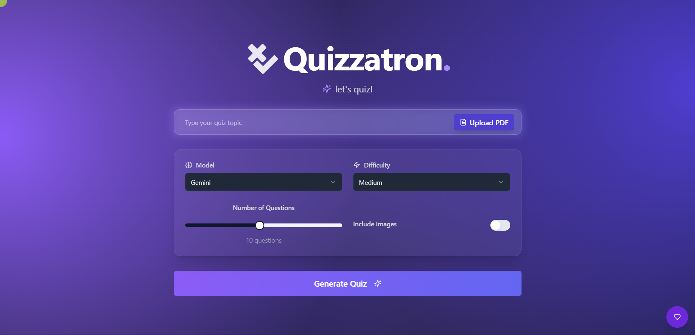

# Quizzatron

<p align="center">
    
    <br>We one-up QuizUp!

---

<p align="center">
    <a href="https://github.com/SVijayB/Quizzatron/pulls">
        
    </a>
<a href="https://github.com/SVijayB/Quizzatron/issues">
    
    </a>
<a href="https://github.com/SVijayB/Quizzatron/graphs/contributors">
    
    </a>
<a href="https://github.com/SVijayB/Quizzatron/blob/master/LICENSE">
    
    </a>
<a href="https://github.com/SVijayB/Quizzatron">
    
    </a>
<a href="https://github.com/SVijayB/Quizzatron/blob/master/.github/CODE_OF_CONDUCT.md">
    
    </a>
<a href="https://github.com/SVijayB/Quizzatron/blob/master/.github/CONTRIBUTING.md">
    
    </a>
    <br>
<a href="https://codecov.io/gh/SVijayB/Quizzatron" > 
     
    </a>
<a href="https://github.com/SVijayB/Quizzatron/actions">
    
    </a>
</p>

## Table of Contents

-   [Motivation](#motivation)
-   [Installation](#installation)
    -   [Using the setup.py script](#method-1-using-the-setuppy-script)
    -   [Manual setup](#method-2-manual-setup)
    -   [Environment variables](#environment-variables)
-   [Usage](#usage)
-   [Project Structure](#project-structure)
    -   [Project demo](#project-demo)
-   [Contributing](#contributing)
-   [License](#license)

## Motivation

<!--- Insert product screenshot below --->



We’re building an AI-powered quizzing system that can generate questions on any topic - SATs, movies, national flags, or whatever you choose! The application supports custom inputs like PDFs or images and can also generate quizzes autonomously using DeepSeek. It provides an engaging learning experience with minimal human input.

To maximize accessibility, our model integrates with APIs, allowing it to function as a Discord bot, a web interface, or a CLI tool. But we didn’t stop there, we wanted to make quizzing fun. Inspired by **QuizUp**, we focused on gamification, incorporating features that users love based on insights from [community discussions](https://www.reddit.com/r/QuizUp/comments/1ahl958/what_the_hell_happened_to_quizup/).

We also used some standard open source trivia data, such as the [OpenTriviaQA](https://github.com/uberspot/OpenTriviaQA) and the [opentdb API](https://opentdb.com/).

## Installation

<!--- Provide instructions on installing the application --->

For the latest stable version, head to [Releases](https://github.com/SVijayB/Quizzatron/releases).

Download and extract the source code.

As an alternative, you could also clone the repository using,

```
git clone https://github.com/SVijayB/Quizzatron.git
```

Once the repository is cloned, run `cd Quizzatron`

### Method 1: Using the setup.py script

The easiest way to get started is to use our setup script, which handles everything automatically:

You can run the setup script in the root directory using

```
python setup.py
```

The script will:

1. Check for Python, Node.js and NPM (providing installation instructions if needed).
2. Create a virtual environment for the backend (Python).
3. Install all required backend and frontend dependencies.
4. Start the Flask API server.
5. Start the frontend development server (if Node.js is available).
6. Automatically open the frontend application in your browser.

### Method 2: Manual setup

Alternatively, you can set up manually:

1. Create a virtual environment:

```
 python -m venv venv
```

2. Activate the virtual environment:

    On Windows: `venv\Scripts\activate`

    On macOS/Linux: `source venv/bin/activate`

3. Install dependencies:

```
 pip install -r requirements.txt
```

4. Install frontend dependencies:

```
cd frontend
npm install
```

### Environment variables

Once the dependencies are installed, you need to set up the environment variables.
Create a `.env` file in the root directory and add the following variables:

```
GOOGLE_API_KEY=ENTER_GEMINI_API_KEY_HERE
MONGO_CONNECTION_STRING=ENTER_MONGO_CONNECTION_STRING_HERE
FLASK_ENV=PRODUCTION/DEVELOPMENT
PORT=PORT_NUMBER_HERE
```

## Usage

<!--- Provide instructions and examples for use. Include screenshots as needed. --->

1. To start the backend server, run the following command in the root directory:

```
flask run
```

2. To start the frontend development server, run the following command in the `frontend` directory:

```
npm run dev
```

## Project Structure

```
├── .github
├── api
│   ├── routes
│   ├── services
│   ├── static
│   ├── templates
│   ├── utils
├── assets
├── docs
│   ├── specs
│   ├── technology_review
│   ├── demo_output
│   └── demo_scripts
├── frontend
│   ├── node_modules
│   ├── public
│   ├── src
│   │   ├── components
│   │   ├── hooks
│   │   ├── lib
│   │   ├── pages
├── scripts
└── tests
│   ├── routes
│   ├── services
│   └── utils

```

### Project demo


You can also find the demo video [here](https://www.youtube.com/watch?v=dQw4w9WgXcQ).

## Contributing

To contribute to Quizzatron, fork the repository, create a new branch and send us a pull request. Make sure you read [CONTRIBUTING.md](https://github.com/SVijayB/Quizzatron/blob/master/.github/CONTRIBUTING.md) before sending us Pull requests.

Thanks for contributing to Open-source! ❤️

Project contributors ([emoji key](https://allcontributors.org/docs/en/emoji-key)):

<!-- ALL-CONTRIBUTORS-LIST:START - Do not remove or modify this section -->
<!-- prettier-ignore-start -->
<!-- markdownlint-disable -->

<!-- markdownlint-restore -->
<!-- prettier-ignore-end -->

<!-- ALL-CONTRIBUTORS-LIST:END -->

## License

Quizzatron is under The MIT License. Read the [LICENSE](https://github.com/SVijayB/Quizzatron/blob/master/LICENSE) file for more information.

---


