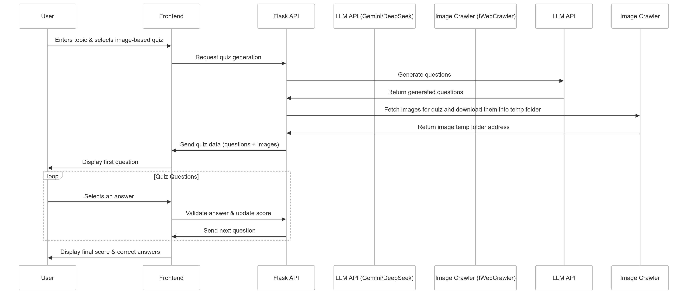
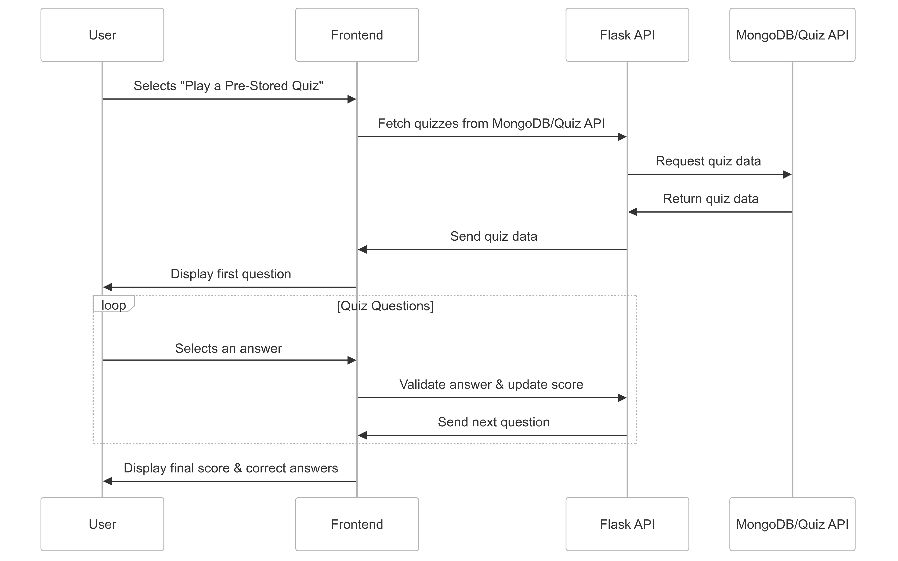
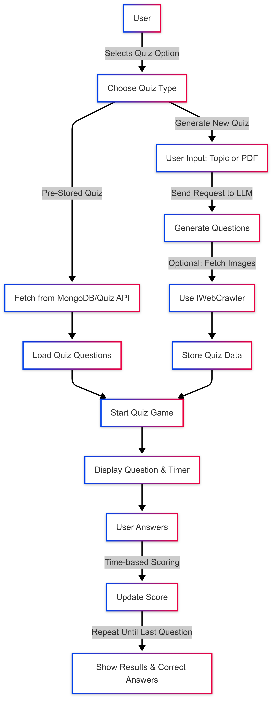
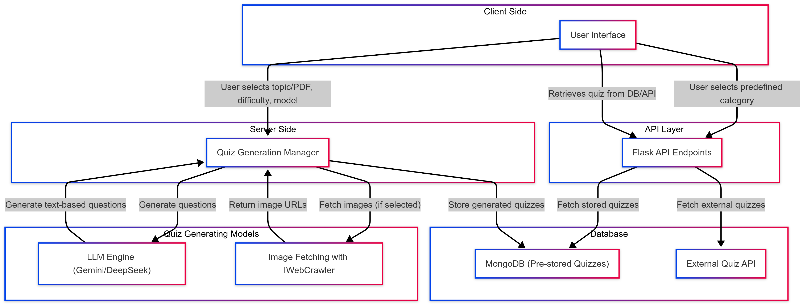

# Component Specification for Quizzatron

## 1. Software Components

### 1.1 Data Manager  
📌 **Purpose:**  
- Manages quiz data by retrieving, storing, and updating quizzes from multiple sources.  
- Integrates **MongoDB** to store predefined quizzes and fetches additional quizzes from an external quiz API - Open Trivia DataBase.  

📥 **Inputs:**  
- User-selected **category**.  
- Quiz stored in **MongoDB** or API requests to fetch quizzes dynamically.

📤 **Outputs:**
- The quiz retrieved for the category.
- Retrieved quiz are formatted as JSON for rendering on **frontend display**.

🛠 **Implementation Details:**  
- Uses **Flask** to interact with MongoDB.  
- Fetches quizzes from an external **quiz API** or stored quizzes based on a category selected by user. 

---

### 1.2 Quiz Generation Manager  
📌 **Purpose:**  
- Handles quiz creation based on **user input** (topic or PDF).  
- Allows **difficulty selection** and supports **multiple LLM models** (Gemini/DeepSeek).  
- Generates **image-based quizzes** if selected by the user.  

📥 **Inputs:**  
- **User input** (topic or PDF).  
- **User preferences** (difficulty level, model selection, image-based or not).  

📤 **Outputs:**  
- A **JSON-formatted quiz** containing questions, answer choices, and (if applicable) images.  

🛠 **Implementation Details:**  
- Extracts **text from PDFs** using `PyPDF`.  
- Uses **LLM APIs** (Gemini or DeepSeek) to generate quizzes.  
- Stores the final quiz in a structured format for the frontend.

### 1.3 Image Fetching Manager  
📌 **Purpose:**  
- Fetches images for **image-based quiz questions** using an automated **web crawler** (`IWebCrawler`).  
- Images fetched based on question generated by Quiz Generation Manager.

📥 **Inputs:**  
- **Keyword-based image requests** from quiz topics or specific question prompts.  

📤 **Outputs:**  
- **Downloaded images** stored locally and linked to quiz questions.  
- Images are referenced in **JSON quiz format** for frontend display.  

🛠 **Implementation Details:**  
- Uses **IWebCrawler (icrawler library)** to perform automated **Google Image Searches**.  
- Stores images in a **temporary folder** and links them to corresponding questions.  
- Includes **error handling** to ensure fallback to **text-based questions** if images fail to load.  

---
### 1.4 Frontend Manager  
📌 **Purpose:**  
- Provides an **interactive UI** for both **quiz generation** and **quiz retrieval**.  
- Manages the **quiz gameplay**, scoring, and result display.  
- Offers **two main options**:  
  1️⃣ **Generate a Quiz:** User inputs a topic or uploads a PDF.  
  2️⃣ **Retrieve a Quiz:** User selects a predefined category from MongoDB or an external quiz API.  

📥 **Inputs:**  
1️⃣ **For Quiz Generation:**  
   - **User input:** Topic (via search bar) or PDF upload.  
   - **User preferences:** Difficulty level, AI model (Gemini/DeepSeek), image-based or text-only.  

2️⃣ **For Quiz Retrieval:**  
   - **User selection:** Predefined quiz category (from MongoDB or external quiz API).  

📤 **Outputs:**  
- **For Generated Quizzes:**  
  - AI-generated quiz is formatted into **a game session** with a timer and score tracking.  

- **For Retrieved Quizzes:**  
  - Predefined quizzes are loaded into the **game session** with the same mechanics.  

🛠 **Implementation Details:**  
- Built using **React.js**.  
- Communicates with Flask API via **REST requests**.  
- UI provides an **interactive quiz experience** where:  
  1️⃣ **Questions are shown one by one** with **four answer options**.  
  2️⃣ **Users have 10 seconds per question** to answer.  
  3️⃣ **Faster answers get more points** (score decreases as time runs out).  
  4️⃣ **At the end, total points are displayed** along with correct and incorrect answers.  

🚀 **Additional Features:**  
- **Real-time countdown timer** for each question.  
- **Dynamic score calculation** based on response time.  
- **Final summary page** with user performance insights.  

## 2. Component Interactions for Use Cases

### Use Case 1: Generating a Custom Quiz  
**User Flow:**  
1️⃣ **User enters a topic** in the search bar.  
2️⃣ Selects **difficulty level** and **AI model (Gemini/DeepSeek)**.  
3️⃣ Selects **image-based quiz** (optional).  
4️⃣ Backend processes the request and fetches quiz data.  
5️⃣ Frontend displays the generated quiz.  

---

### Use Case 2: Browsing Predefined Quizzes  
**User Flow:**  
1️⃣ **User navigates** to a list of quiz categories.  
2️⃣ Selects a **category** (predefined or from the quiz API).  
3️⃣ Backend fetches quizzes from **MongoDB or API**.  
4️⃣ Quiz list is displayed on the frontend.

## 3. Flow

## 4. Architecture

