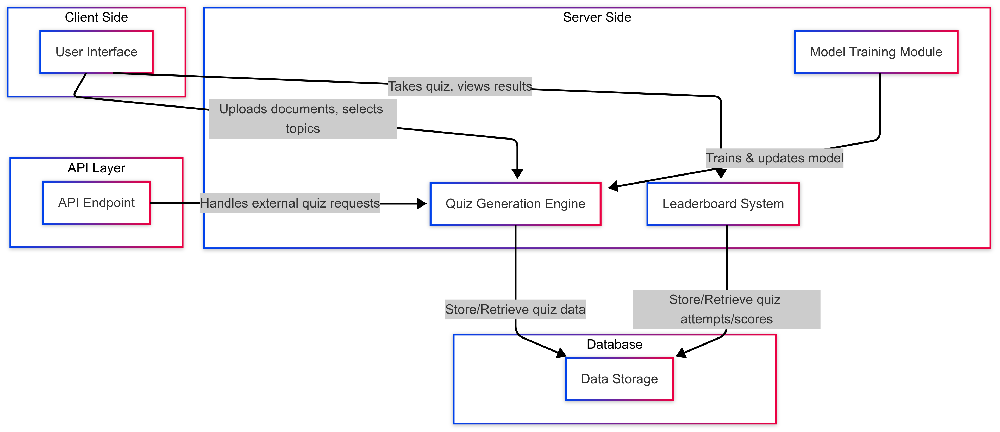

# Component specifications

## Overview

#### UserInterface

**Description**: The front-end interface where users interact with the system.

**Responsibilities:**

-   Allow users to upload documents (PDF, DOCX, TXT).
-   Provide a UI to select topics and difficulty levels.
-   Display quizzes and results.
-   Show leaderboard and past results.

**Inputs:**

-   Document upload.
-   Topic selection.
-   Difficulty level.
-   Number of questions.

**Outputs:**

-   Quiz interface with multiple-choice questions.
-   Results and leaderboard.
-   Option to export quiz results as PDF/JSON.

---

#### QuizGenerationEngine

**Description:** The core logic responsible for generating quiz questions from user inputs.

**Responsibilities:**

-   Process input document and extract relevant text.
-   Determine difficulty level based on user selection and text analysis.
-   Generate multiple-choice questions.
-   Provide an API to interact with the generated quiz.

**Inputs:**

-   Document or topic.
-   Difficulty level.
-   Number of questions.

**Outputs:**

-   List of multiple-choice questions with correct answers.

---

#### LeaderboardSystem

**Description:** Tracks and displays user scores across quizzes.

**Responsibilities:**

-   Store quiz results.
-   Rank users based on scores.
-   Display leaderboard in UI.

**Inputs:** User quiz results.
**Outputs:**

-   Ranked leaderboard display.

---

#### API

**Description:** Provides an API for developers to integrate quiz generation into their applications.

**Responsibilities:**

-   Authenticate users via API keys.
-   Accept topic/document as input.
-   Return generated quiz questions.

**Inputs:**

-   API key.
-   Topicdocument.

**Outputs:** JSON response with multiple-choice questions.

---

#### ModelTrainingModule

**Description:** Allows data scientists to fine-tune the question-generation model.

**Responsibilities:**

-   Provide access to model parameters.
-   Train and update the model based on new data.
-   Support multimodal data inputs.

**Inputs:**

-   Training data.
-   Model hyperparameters.

**Outputs:**

-   Updated model.
-   Improved question-generation accuracy.

---

#### DataStorage

**Description:** Stores quiz results, user data, and model training data.

**Responsibilities:**

-   Maintain user progress and scores.
-   Store uploaded documents securely.
-   Provide access to historical quiz data.

**Inputs:**

-   User quiz attempts.
-   Uploaded documents.

**Outputs:**

-   Stored user progress.
-   Retrieved quiz history.

---

### Interaction diagram
