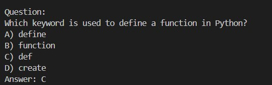
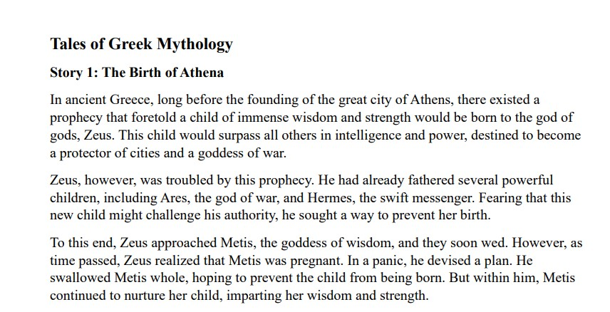
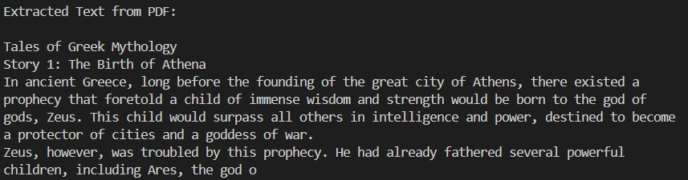
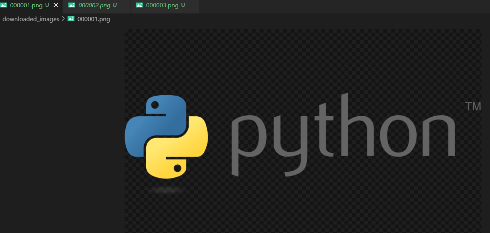

# Quizzatron Technology Review

## **Introduction**

In this technology review, we analyze and compare different Python libraries used in the **Quizzatron** application, which generates quiz questions based on user input or PDF documents. The primary requirements for the chosen libraries are:

1. **AI-powered question generation** (choosing between various LLMs)
2. **Efficient PDF text extraction**
3. **Image search for logo-based quiz questions**

We evaluate the selected libraries in terms of functionality, ease of use, performance, and compatibility.

---

## **Technology Requirements**

### **1. AI Model for Question Generation**
To generate quiz questions, we need an AI-powered LLM. Options considered:
- OpenAI GPT models (paid, high quality)
- Google Gemini API (free, reliable, well-integrated with Google services)
- DeepSeek LLM (local, free alternative to OpenAI)

### **2. PDF Processing for Quiz Extraction**
To extract text from PDFs and generate questions, we need a reliable library:
- `pypdf` (actively maintained, better than `PyPDF2`)
- `PyMuPDF` (faster, supports images but more complex API)
- `pdfplumber` (useful for structured PDFs, unnecessary for plain text PDFs)

### **3. Image Search for Quiz Images**
For generating image-based questions, we need an automated image search tool:
- `icrawler` (easy to use, supports Google image search)
- `duckduckgo_search` (API-based, sometimes blocked)
- `SerpAPI` (powerful but paid)

---

# 🔹 LLM Comparison
| Feature               | Google Gemini API | DeepSeek LLM | OpenAI GPT |
|----------------------|-----------------|-------------|-----------|
| **Free Tier Available** | ✅ Yes | ✅ Yes | ❌ No |
| **Offline Capability** | ❌ No | ✅ Yes | ❌ No |
| **Performance** | ⚡ Fast | 🛠️ Moderate | ⚡ Fast |
| **Ease of Use** | ✅ Easy | 🛠️ Moderate | ✅ Easy |
| **Best For** | General-purpose AI | Local LLM usage | High-quality AI |

---

# 📄 PDF Processing Comparison
| Feature               | pypdf | Alternative (PyMuPDF, pdfplumber) |
|----------------------|-------|----------------------------------|
| **Free Tier Available** | ✅ Yes | ✅ Yes |
| **Offline Capability** | ✅ Yes | ✅ Yes |
| **Performance** | ⚡ Fast | 🛠️ Moderate (PyMuPDF is faster) |
| **Ease of Use** | ✅ Easy | 🛠️ Moderate (More features but complex) |
| **Best For** | Extracting PDF text | Handling scanned PDFs, annotations |

---

# 🖼️ Image Search Comparison
| Feature               | icrawler | Alternative (DuckDuckGo, SerpAPI) |
|----------------------|---------|----------------------------------|
| **Free Tier Available** | ✅ Yes | ❌ No (SerpAPI is paid) |
| **Offline Capability** | ✅ Yes | ❌ No (API-based) |
| **Performance** | 🛠️ Moderate | ⚡ Fast (SerpAPI is very fast) |
| **Ease of Use** | ✅ Easy | 🛠️ Moderate (API setup required) |
| **Best For** | Searching & downloading images | Faster, more accurate results |

---

## 🚀 Summary
- **LLMs:** Gemini is best for online, **DeepSeek for local**, OpenAI GPT is high quality but **paid**.
- **PDF Processing:** `pypdf` is simple and **fast**, but alternatives handle **complex PDFs**.
- **Image Search:** `icrawler` is **free and easy**, but **SerpAPI is faster (paid)**.


## **Final Technology Choices**

### **1. AI Model for Quiz Generation**: **Google Gemini API & DeepSeek**
- **Reason**: OpenAI GPT is **too expensive**, while **Gemini offers free-tier access**, and **DeepSeek runs locally**.
- **Drawbacks**: Gemini API may **rate-limit requests**, while DeepSeek can be **slow on local hardware**.

### **2. PDF Processing**: **pypdf**
- **Reason**: Simple API, lightweight, and well-maintained.
- **Drawbacks**: Struggles with **non-text PDFs** (scanned documents).

### **3. Image Search**: **icrawler**
- **Reason**: Automates **Google Image** downloads without API keys.
- **Drawbacks**: Slower than **paid APIs** like SerpAPI.

---

## **Demo Implementation**

We created three demo scripts demonstrating the use of:
- **Google Gemini API** for quiz generation

Input code:
```python
from google import genai
import os
from dotenv import load_dotenv

# Load API key from .env file
load_dotenv()
GOOGLE_API_KEY = os.getenv("GOOGLE_API_KEY")
client = genai.Client(api_key=GOOGLE_API_KEY)

# Define a prompt for generating a quiz question
prompt = """
Generate a single multiple-choice quiz question about Python programming.
The format should be:

Question:
A) Option 1
B) Option 2
C) Option 3
D) Option 4
Answer: Correct_Option
"""


response = client.models.generate_content(
            model="gemini-2.0-flash-lite", contents=prompt
        )
# Print the generated question
print("Generated Quiz Question:\n")
print(response.text.strip())

```

Output:




- **pypdf** for PDF extraction

Input:



Code:

```python
from pypdf import PdfReader

def extract_text_from_pdf(pdf_path):
    """Extracts and prints text from a PDF using pypdf."""
    reader = PdfReader(pdf_path)
    text = "\n".join([page.extract_text() for page in reader.pages if page.extract_text()])
    return text

# Provide a PDF file path
pdf_path = "D:\My UW\quarter 2\Data 515 Software Design\project\Quizzatron\docs\Week 3 Inference for Comparing Two or More Means and Proportions.pdf"  # Change this to an actual file path

def extract_text_from_pdf(pdf_path):
    with open(pdf_path, "rb") as file:
        reader = PdfReader(file)
        text = "\n".join(
            [page.extract_text() for page in reader.pages if page.extract_text()]
        )
    return text if text else None
# Extract and print the PDF text
extracted_text = extract_text_from_pdf(pdf_path)
print("Extracted Text from PDF:\n")
print(extracted_text[:500])  # Print only first 500 characters

```

Output:




- **icrawler** for image search

Input:

```python
from icrawler.builtin import GoogleImageCrawler

def fetch_images(query, max_num=3):
    """Downloads images based on a search query."""
    crawler = GoogleImageCrawler(storage={"root_dir": "downloaded_images"})
    crawler.crawl(keyword=query, max_num=max_num)

# Example: Search for "Python programming logo"
fetch_images("Python programming logo")
print("✅ Images downloaded successfully! Check the 'downloaded_images' folder.")

```

Output:




Each demo highlights basic functionality and integration within the **Quizzatron** application.

---

## **Conclusion**
The selected libraries **balance cost, efficiency, and ease of use** for our quiz-generation needs. Future improvements may include **fine-tuning a local LLM** to reduce dependency on cloud APIs. 🚀
